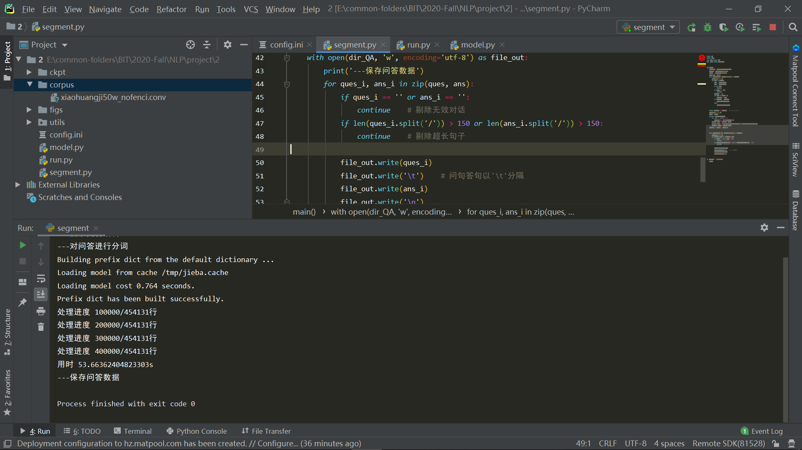
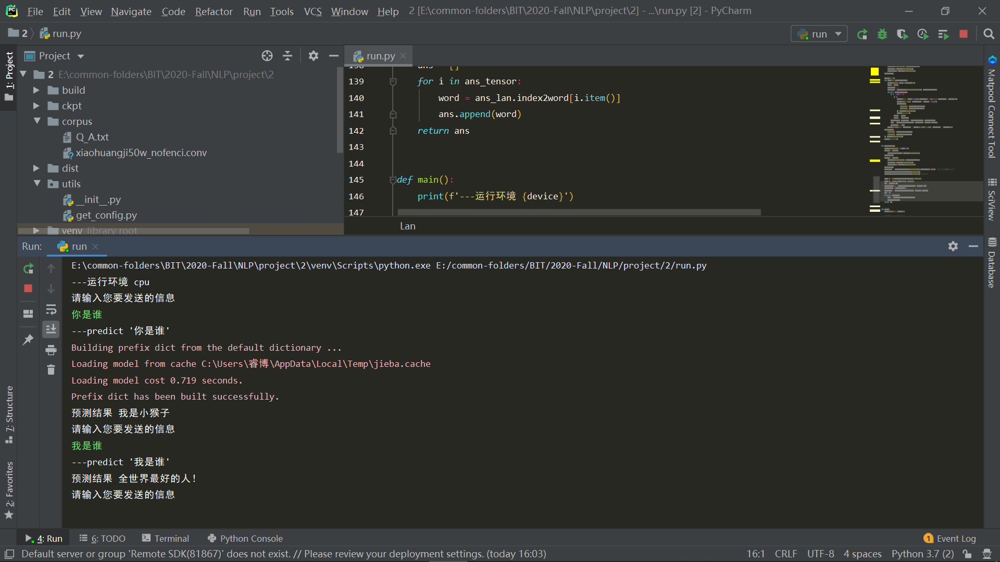
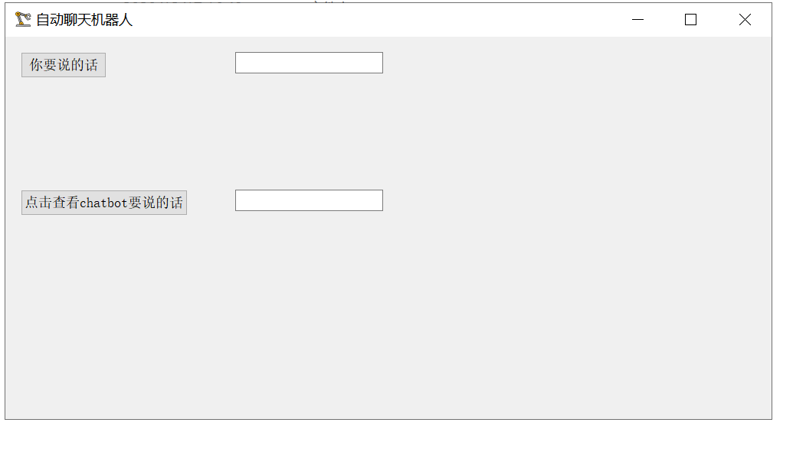
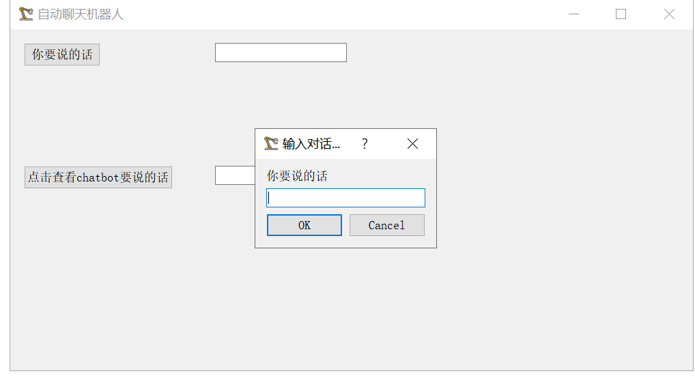
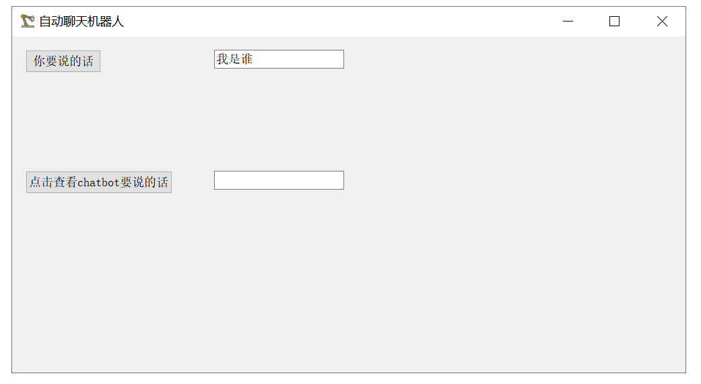
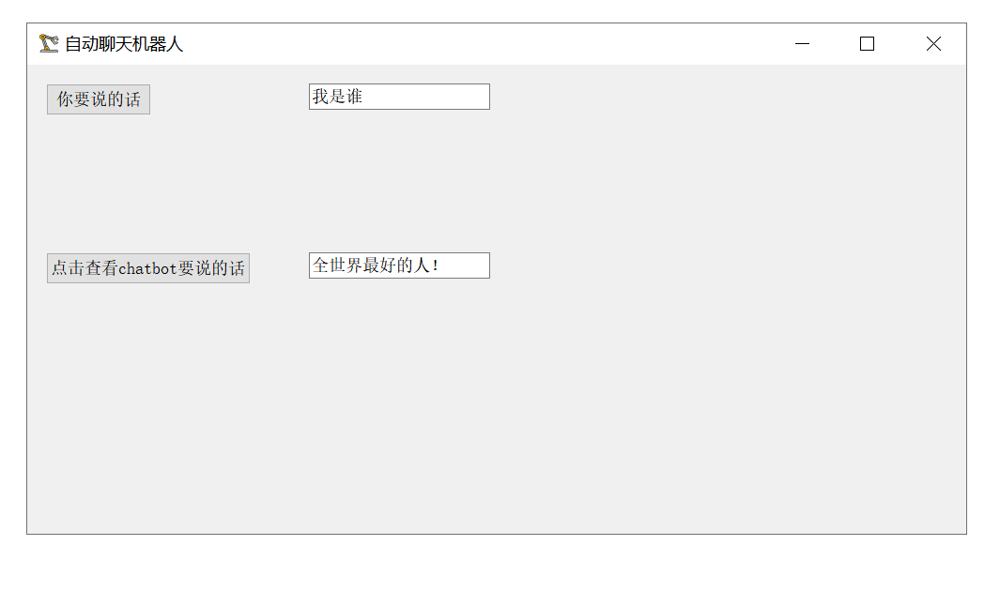

# Automatically Chatbot

## requirements

1. `pytorch`
2. `jieba`
3. `pyinstaller`（仅在打包成可执行文件时使用）
4. `PyQt5`

## 核心思想与算法描述

使用开源的`小黄鸡`语料（内含几十万条对话数据），使用`PyTorch`框架、`jieba`中文分词包，搭建含`Attention`的`Encoder-Decoder`结构开发一个自动聊天机器人。

1. `segment.py`
   1. 对原始语料进行处理，组织成工整的对话格式。
   2. 调用`jieba`库对语料进行分词，存储在`corpus/Q_A.txt`。
      1. 剔除问/答为空的情况。
      2. 剔除分词后长度大于15的句子。
2. `run.py`
   1. `class Lan`
      1. 我们一共建立两个`Lan`实例，分别为问句语言库、答句语言库。
      2. 内含三个`dict`，分别为`word2index{word: index}`、`index2word{index: word}`、`word2count{word: count}`，以及一个成员变量`num_words`记录语言库能够识别的单词总数。
   2. `def create_dataset()`
      1. 打开预处理好的语料，并在每句前后加入起始符`SOS`和停止符`EOS`。
      2. 生成两个语言库（`class Lan`），分别为`ques_lan`、`ans_lan`。
   3. `def create_tensor()`
      1. 把`ques_lan`、`ans_lan`从文字变成向量（对应的`index`）。
   4. `def train()`
      1. 调用`def create_dataset()`。
      2. 调用`def create_tensor()`。
      3. 实例化`Encoder()`、`Decoder()`。
      4. 对每一条训练对话调用`def train_step()`，并在每一千条对话之后保存模型参数到`ckpt/model.pt`。
   5. `def predict()`
      1. 接收用户输入的信息，并对其进行分词。
      2. 加载模型。
      3. 调用`def predict_step()`进行预测，并返回预测结果。
3. `model.py`
   1. `class Encoder(nn.Module)`
      1. `def __init__()`
         1. 实例化`embedding`层。
         2. 实例化`gru`层。
      2. `def forward()`
         1. 调用`embedding`层，将输入的一个单词的`index`投影到高维空间（维数为可变超参`dim_hidden`）。
         2. 调用`gru`层，进行序列编码。
   2. `class Decoder(nn.Module)`
      1. `def __init__()`
         1. 实例化`embedding`层。
         2. 实例化`gru`层。
         3. 实例化`out`层。
         4. 实例化`att`层。
         5. 实例化`att_combine`层。
         6. 实例化`dropout`层。
      2. `def forward()`
         1. 调用`embedding`层。
         2. 调用`dropout`层。
         3. 调用`att`层，使用`embed`向量和隐变量`hidden`进行`att_weight`的计算。
         4. 进行`attn_weights`, `encoder_outputs`的矩阵乘法，提取当前词对整个问句的注意力分配。
         5. 调用`gru`层进行序列解码。
         6. 调用`out`层提取最终预测的单词。
   3. `def train_step()`
      1. 为`Encoder`、`Decoder`分别生成一个`SGD`优化器。
      2. 调用`def Encoder.forward()`对问句进行序列编码，并且记录`encoder.outputs`，用于计算注意力系数。
      3. 调用`def Decoder.forward()`对提取出的隐状态进行序列解码，并与标准答案进行比较，计算`loss`。
         1. 注意，在这里我们使用一个超参`teacher_forcing`来控制所使用的输入是真实数据还是模型从上一步中生成的输入。
      4. 梯度回传，通过优化器更新模型参数。
   4. `def predict_step()`
      1. 调用`def Encoder.forward()`对问句进行序列编码，并且记录`encoder.outputs`，用于计算注意力系数。
      2. 调用`def Decoder.forward()`对提取出的隐状态进行序列解码，返回预测结果。
4. `app.py`
   系统入口（前端）
   1. `class Dialog`
      1. 包含一个按钮和两个行编辑部件。
      2. 单击按钮会弹出输入对话框，以获取用户输入的文本数据，该文本数据将会显示在第一个行编辑部件中。
      3. 单击第二个按钮会把机器人的回答显示在第二个行编辑部件中。

## 系统主要模块流程

### 开发过程

1. 运行`segment.py`进行语料预处理。
2. 在`run.py`中运行`def train()`进行模型的训练。
3. 在`run.py`中运行`def predict()`进行模型的预测（检验模型训练效果）。
4. 使用

         pyinstaller -F -w app.py
   
   对程序进行打包，`-F`代表打包成单一文件，`-w`代表运行时不显示控制台。
### 使用过程

1. 运行`app.py`打开本聊天机器人系统。
2. 单击按钮`你要说的话`，并输入`你是谁`，之后系统会把你的输入显示在与按钮水平的文本框内。
3. 单击按钮`点击查看chatbot要说的话`，之后系统会把机器人要说的话显示在与按钮水平的文本框内。
4. 只要不主动退出，就可以一直聊天下去。
5. 无论是运行可执行文件还是`.py`文件，都会有一段时间的静默等待。

## 实验结果及分析

1. 首先探索可以达到过拟合的模型超参。
   1. 训练一条语句，`num_epoch=100, dim_hidden=32`。
   2. 训练十条语句，`num_epoch=100, dim_hidden=128`。
   3. 训练一百条语句，`num_epoch=100, dim_hidden=128`。
   4. 训练一千条语句，`num_epoch=100, dim_hidden=128`。
2. 训练过程日志保存在`logs/train.log`。
3. 打包成可执行文件日志保存在`logs/pkg.log`。
4. 最终，我们只使用两千条语句，选择`num_epoch=100, dim_hidden=128`进行训练。可以达到良好的效果，如果加卡加时间（如训练全部的几十万条语句，`num_epoch=100, dim_hidden=256`），预计可以达到极佳的效果。
5. 预处理程序运行图
   
   

6. Pycharm内运行图

   

7. 可执行文件运行方法
   1. 由于乐学限制附件大小，不提供可执行程序。
   2. 进入`可执行文件/dist`目录下，执行`app.exe`文件即可。
   3. 执行时会有一个警告弹窗，点击`确定`即可。
   4. 执行时会花费大概两分钟来运行程序，请耐心等待。

8. 系统运行演示
   1. 初始页面
      
      
   
   2. 输入之前

      

   3. 输入之后
   
      
   
   4. 点击查看机器人要说的话

      

    

## 存在的问题

1. 由于时间、算力限制，只使用`几十万条语句`中的`两千条`进行了`100`个`epoch`的训练，总训练时长两小时，模型的鲁棒性和泛化性不强，训练好的`model.pt`仅作演示使用。
2. 由于没有对未出现的词进行相应的处理，不能输入词库中没有出现过的词。
3. 建议输入（效果比较好）：`你是谁`、`我是谁`。

## references

[zhaoyingjun's chatbot](https://github.com/zhaoyingjun/chatbot)

[candlewill's corpus collection](https://github.com/candlewill/Dialog_Corpus)

[xiaohuangji corpus](https://github.com/aceimnorstuvwxz/dgk_lost_conv/tree/master/results)

